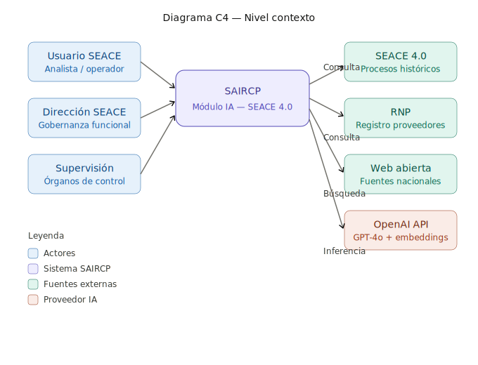
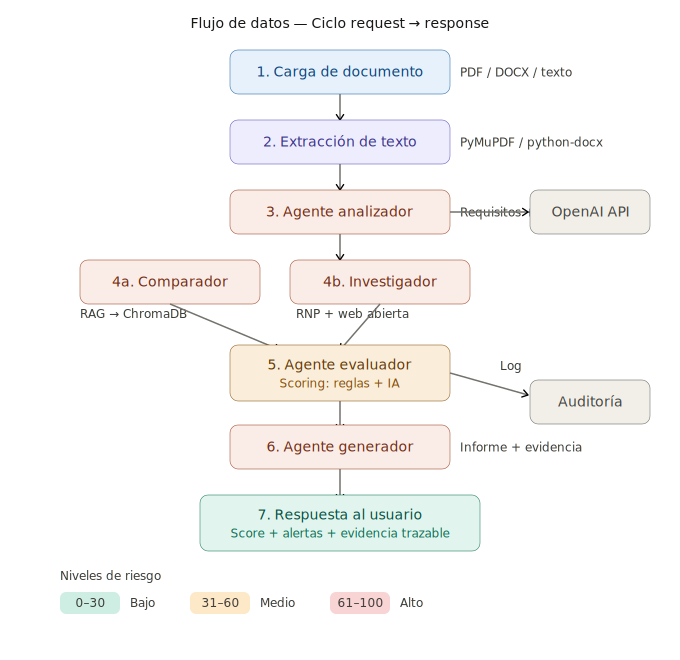

# SAIRCP-LLM-RAG — Documentación Unificada del Proyecto

**Programa:** AI-LLM Solution Architect  
**Curso:** 5 — Proyecto Final de Arquitectura e Integración AI/LLM  
**Participante:** Bretts Acuña  
**Versión:** v1.0.0  
**Repositorio:** https://gitlab.com/ia/saircp-llm-rag  
**Stack:** Python 3.11, FastAPI, OpenAI GPT-4o, ChromaDB, PostgreSQL 16, Docker  
**Entorno:** Hybrid (on-premise OECE + OpenAI API)

---

# 1. INTRODUCCIÓN

El Organismo Especializado para las Contrataciones Públicas Eficientes (OECE) propone la implementación de un sistema basado en Inteligencia Artificial (IA) como extensión del SEACE 4.0, orientado a la identificación de riesgos en documentos de contratación pública.

El sistema permitirá analizar automáticamente documentos clave del proceso de contratación, tales como términos de referencia (TDR), bases administrativas, especificaciones técnicas y estudios de mercado, con el fin de detectar posibles restricciones a la competencia y generar alertas con evidencia trazable para la toma de decisiones.

Esta iniciativa se orienta a fortalecer el control preventivo, mejorar la transparencia y contribuir a la estandarización del análisis de documentos de contratación pública dentro del ecosistema del SEACE 4.0.

---

# 2. DOCUMENTO DE ALCANCE DEL PROYECTO

## 2.1 Problema

Actualmente, la evaluación de documentos de contratación pública se realiza de manera mayormente manual, lo que dificulta la identificación oportuna de riesgos de direccionamiento, afectando la transparencia, la pluralidad de proveedores y la competencia en los procesos de contratación.

Esta situación incrementa la carga operativa de revisión, limita la capacidad de análisis comparativo con procesos previos y puede originar observaciones posteriores por parte de órganos de control, debido a la inclusión de requisitos técnicos, comerciales o documentales potencialmente restrictivos.

## 2.2 Objetivo

Implementar un sistema basado en Inteligencia Artificial, como extensión funcional del SEACE 4.0, que permita identificar de manera automatizada riesgos de direccionamiento en documentos de contratación pública, generando alertas con evidencia trazable y mecanismos de apoyo a la toma de decisiones.

## 2.3 5W + H

### 2.3.1 WHAT (¿Qué?)

El proyecto consiste en la implementación de un sistema inteligente que permita analizar documentos de contratación pública, identificar patrones de riesgo relacionados con restricciones a la competencia y generar reportes automatizados con soporte documental y trazabilidad.

El sistema analizará documentos como términos de referencia, especificaciones técnicas, bases administrativas y estudios de mercado, mediante técnicas de procesamiento de lenguaje natural, modelos de lenguaje y mecanismos de recuperación de información.

### 2.3.2 WHY (¿Por qué?)

La iniciativa responde a la necesidad de fortalecer el control preventivo en la formulación de requerimientos técnicos y documentos de contratación, donde pueden presentarse condiciones que limiten la libre competencia o reduzcan la pluralidad de proveedores.

Asimismo, busca mejorar la eficiencia operativa del análisis documental, estandarizar criterios de revisión y contribuir a la transparencia del sistema de contrataciones públicas.

### 2.3.3 WHO (¿Quién?)

La Dirección del SEACE del OECE será el órgano responsable del liderazgo funcional del sistema, incluyendo la gobernanza del módulo, la definición de reglas de negocio y la supervisión de su operación.

La Oficina de Tecnologías de la Información participará en la implementación técnica, despliegue, seguridad, interoperabilidad y sostenibilidad de la solución. Las entidades públicas usuarias del SEACE utilizarán el módulo como herramienta de apoyo en la revisión de documentos, mientras que los resultados podrán servir como insumo complementario para instancias de supervisión y control.

### 2.3.4 WHERE (¿Dónde?)

El sistema será implementado como un módulo integrado al SEACE 4.0, desplegado sobre la infraestructura tecnológica institucional del OECE, ya sea en entorno on-premise, nube híbrida o una arquitectura compatible con los lineamientos de interoperabilidad y seguridad institucional.

### 2.3.5 WHEN (¿Cuándo?)

La implementación se plantea por fases, iniciando con la definición de alcance, requerimientos y arquitectura, seguida del desarrollo del producto mínimo viable, integración con fuentes relevantes, pruebas, piloto y despliegue progresivo.

Se estima una duración inicial de ocho semanas para la versión entregable del proyecto académico/documental, con posibilidad de ampliación en una implementación institucional real.

### 2.3.6 HOW (¿Cómo?)

El sistema será implementado como una extensión del SEACE 4.0, utilizando una arquitectura basada en módulos de análisis documental, motores de búsqueda, agentes de IA, mecanismos de scoring de riesgo y componentes de generación de informes.

El flujo general contemplará la carga o lectura del documento desde el SEACE, su análisis automático, la búsqueda y comparación con fuentes relevantes, la identificación de patrones de riesgo y la generación de un informe con alertas, evidencia y trazabilidad.

## 2.4 Alcance y Delimitación

Definición precisa de lo que está dentro y fuera del alcance de la versión entregada.

| ✅ EN SCOPE | ❌ OUT OF SCOPE |
|------------|---------------|
| Integración del módulo de Inteligencia Artificial como extensión del SEACE 4.0 | Determinación automática de actos de corrupción o ilegalidad |
| Análisis automático de documentos de contratación (TDR, bases administrativas, especificaciones técnicas y estudios de mercado) | Aplicación de sanciones o bloqueo de procesos de contratación |
| Procesamiento de lenguaje natural para identificación de requisitos, restricciones y condiciones técnicas | Reemplazo de la evaluación humana en la toma de decisiones |
| Detección de patrones de riesgo como marca, modelo, certificaciones restrictivas y exigencias desproporcionadas | Entrenamiento de modelos de IA desde cero o fine-tuning base en esta fase |
| Consulta de procesos históricos y documentación comparable dentro del SEACE | Acceso a información privada, confidencial o no pública |
| Integración con el Registro Nacional de Proveedores (RNP) para identificar potenciales proveedores | Integración con sistemas externos no oficiales o no autorizados |
| Búsqueda en fuentes web abiertas nacionales para validación de disponibilidad de proveedores | Soporte multilenguaje distinto al español en esta fase |
| Implementación de un motor de scoring de riesgo con categorías bajo, medio y alto | Analítica predictiva avanzada sobre comportamiento futuro de proveedores |
| Generación de informes automatizados con evidencia trazable y justificación del resultado | Automatización completa del proceso de contratación pública |
| Visualización de alertas dentro del flujo del SEACE antes de la publicación del proceso | Integración con sistemas internacionales de contratación o proveedores |
| Registro de auditoría de análisis realizados, usuarios, fechas y resultados | Uso de datos sensibles sin mecanismos de anonimización y control |
| Implementación sobre infraestructura institucional compatible con OECE | Personalización avanzada por entidad en esta primera versión |
| Cumplimiento de lineamientos de seguridad, trazabilidad y gobierno digital | Dependencia obligatoria de modelos propietarios sin control institucional |

## 2.5 Indicadores Clave de Éxito (KPIs del Proyecto)

| KPI / Métrica | Línea Base | Meta Objetivo | Resultado Obtenido |
|--------------|-----------|--------------|--------------------|
| Latencia promedio de análisis (p95) | N/A | < 30 segundos | Completar al final |
| Tasa de detección de riesgos | Baseline inicial | > 85% | Completar al final |
| Precisión en identificación de requisitos | Baseline inicial | > 85% | Completar al final |
| Cobertura de análisis de documentos (%) | 0% | > 90% | Completar al final |
| Tasa de generación de informes exitosos | N/A | 100% | Completar al final |
| Disponibilidad del sistema | N/A | ≥ 99.5% | Completar al final |
| Tiempo de respuesta en consultas externas | N/A | < 5 segundos | Completar al final |
| Nivel de satisfacción de usuario | N/A | > 85% | Completar al final |
| Porcentaje de alertas con evidencia trazable | N/A | 100% | Completar al final |
| Reducción de observaciones en procesos | Baseline institucional | > 20% | Completar al final |

---

## 3. Diseño de Arquitectura AI/LLM

### 3.1 Diagrama de Arquitectura General (Nivel C4 — Contexto y Contenedor)

> Los diagramas C4 de Contexto y Contenedor se encuentran como archivos SVG de alta resolución en `/docs/architecture/`. A continuación se describe cada nivel.

**Nivel Contexto:** El sistema SAIRCP se posiciona como un módulo integrado al ecosistema del SEACE 4.0. Interactúa con tres tipos de actores (usuarios operativos del SEACE, Dirección del SEACE como gobernanza funcional, e instancias de supervisión/control) y con cuatro sistemas externos (SEACE 4.0 para procesos históricos, Registro Nacional de Proveedores para validación de mercado, fuentes web abiertas nacionales, y OpenAI API como proveedor de inferencia LLM).

**Nivel Contenedor:** La arquitectura interna se descompone en:
- **Capa de Presentación:** Frontend Angular integrado al SEACE + API Gateway FastAPI
- **Capa de Orquestación:** Backend del módulo IA con orquestador de 5 agentes especializados
- **Capa de Procesamiento:** Motor documental (extracción PDF/DOCX), Motor IA (RAG + LLM), Motor de scoring (reglas + pesos)
- **Capa de Datos:** ChromaDB (vector store), PostgreSQL (auditoría/metadata), OpenSearch (indexación documental)

*Figura 1. Diagrama C4 Contexto — ver `/docs/architecture/saircp_c4_context_diagram`*  

*Figura 2. Diagrama C4 Contenedor — ver `/docs/architecture/saircp_c4_container_diagram`*


### 3.2 Descripción de Componentes Arquitectónicos

| Componente | Tecnología / Servicio | Responsabilidad Principal | Justificación de Selección |
|------------|----------------------|--------------------------|---------------------------|
| API Gateway | FastAPI 0.115+ | Enrutamiento REST, validación de schemas, rate limiting, health check | Framework Python nativo async con auto-generación de OpenAPI/Swagger, alto rendimiento con Uvicorn, curva de aprendizaje baja para el equipo |
| Orquestador LLM | Implementación custom (AgentOrchestrator) | Coordinación secuencial de 5 agentes especializados, manejo de contexto entre agentes | Evita dependencia de LangChain (over-engineering para este caso); control total del flujo, debugging directo, sin abstracciones innecesarias (ver ADR-003) |
| Modelo LLM Base | OpenAI GPT-4o | Análisis semántico, extracción estructurada, evaluación de riesgo, generación de informes | JSON mode nativo, excelente comprensión de español legal/administrativo, 128K context window, latencia competitiva (ver ADR-001) |
| Embeddings | OpenAI text-embedding-3-small | Vectorización de documentos para búsqueda semántica RAG | 1536 dimensiones, costo 5x menor que text-embedding-3-large, rendimiento adecuado para español, integración directa con la API ya utilizada |
| Vector Store | ChromaDB 0.5+ | Almacenamiento y búsqueda de similitud coseno para RAG | Persistencia local (compatible on-premise OECE), zero-config, HNSW nativo, Apache 2.0, bajo consumo de recursos (ver ADR-002) |
| Base de Datos | PostgreSQL 16 | Persistencia de auditoría, bitácoras, metadata de análisis, usuarios | Motor maduro, robusto, ya presente en la infraestructura institucional del OECE |
| Motor de Búsqueda | OpenSearch | Indexación full-text de documentos SEACE, búsqueda por términos y filtros | Fork open-source de Elasticsearch, compatible con la infraestructura institucional, soporte de búsqueda en español |
| Observabilidad | structlog + logging estándar Python | Logs estructurados JSON, trazabilidad de cada análisis | Integrable con cualquier stack de monitoreo futuro (ELK, Grafana Loki), sin vendor lock-in |
| Seguridad / IAM | JWT (python-jose) + OAuth 2.0 integrado a SEACE | Autenticación/autorización mediante sesión institucional existente | Reutiliza el mecanismo de identidad del SEACE 4.0, sin crear un segundo sistema de login |
| Contenedores | Docker + Docker Compose | Empaquetamiento, despliegue reproducible, aislamiento de servicios | Estándar de la industria, compatible con OpenShift institucional, facilita CI/CD |

### 3.3 Diagrama de Flujo de Datos e Integración

El ciclo completo de una solicitud de análisis sigue 7 pasos secuenciales:

1. **Carga de documento:** El usuario sube un PDF/DOCX o el sistema lee el documento asociado al proceso SEACE.
2. **Extracción de texto:** PyMuPDF (PDF) o python-docx (DOCX) extraen el contenido textual limpio.
3. **Agente Analizador:** GPT-4o con JSON mode extrae requisitos técnicos, comerciales, documentales, marcas mencionadas, certificaciones, y evalúa la calidad de la justificación técnica.
4. **Agente Comparador + Investigador (parallelizable en fase 2):**
   - Comparador: Busca en ChromaDB procesos similares vía embeddings y detecta divergencias.
   - Investigador: Consulta fuentes externas (RNP, web abierta) para evaluar pluralidad de proveedores.
5. **Agente Evaluador:** Aplica el modelo de scoring híbrido (13 indicadores con pesos, total 0-100) y genera alertas con evidencia.
6. **Agente Generador:** Construye el informe final con resumen ejecutivo, hallazgos clave y recomendaciones.
7. **Respuesta al usuario:** Se retorna el score de riesgo (BAJO/MEDIO/ALTO), las alertas con fragmentos del documento resaltados, y la evidencia trazable. Se registra la bitácora de auditoría.

*Figura 3. Flujo de datos request→response — ver `/docs/architecture/saircp_data_flow_request_response`*


### 3.4 Estrategia de Diseño de Prompts y RAG

**System Prompt Base (Agente Analizador):**

```
Eres un analista experto en contrataciones públicas del Perú (Ley 30225 y su Reglamento).
Tu tarea es analizar documentos de contratación (TDR, bases administrativas, especificaciones
técnicas, estudios de mercado) y extraer información estructurada.

DEBES RETORNAR SOLO JSON VÁLIDO con esta estructura exacta:
{
  "requirements": ["lista de requisitos técnicos, comerciales y documentales"],
  "restrictions": ["posibles restricciones a la competencia detectadas"],
  "brands_mentioned": ["marcas o modelos específicos"],
  "certifications": ["certificaciones exigidas"],
  "experience_requirements": ["requisitos de experiencia"],
  "geographic_restrictions": ["restricciones geográficas"],
  "equivalent_expression_present": true/false,
  "technical_justification_quality": "fuerte|débil|ausente",
  "key_fragments": [{"text": "fragmento", "reason": "relevancia"}]
}

RESTRICCIONES:
- Analiza SOLO en base al contenido proporcionado.
- No inventes información que no esté en el documento.
- Sé preciso en la extracción de fragmentos textuales.
- Identifica lenguaje alineado a fichas comerciales específicas.

FORMATO DE RESPUESTA: JSON estricto según el schema indicado.
```

Cada agente tiene su propio system prompt especializado con instrucciones, restricciones y schema de salida JSON específico. Los 5 prompts completos se encuentran documentados en el código fuente (`src/agents/*.py`).

**Parámetros del modelo:**
- `temperature: 0.0` (determinismo para reproducibilidad)
- `response_format: {"type": "json_object"}` (garantía de JSON válido)
- `max_tokens: 4096` (suficiente para respuestas estructuradas)
- Seed fijo para consistencia entre ejecuciones (pendiente implementación)

### 3.5 Arquitectura Física (Equivalencias por Nube)

| Capa | AWS | GCP | On-Premise (OECE) |
|---|---|---|---|
| Ingesta | Lambda / ECS | Cloud Run | Docker container |
| Almacenamiento documentos | S3 | GCS | Filesystem / MinIO |
| Vector Store | OpenSearch Serverless | Vertex AI Vector Search | ChromaDB (local) |
| Base de datos | RDS PostgreSQL | Cloud SQL | PostgreSQL 16 |
| Orquestación | ECS / EKS | Cloud Run / GKE | Docker Compose / OpenShift |
| Observabilidad | CloudWatch | Cloud Monitoring | structlog + Grafana |
| LLM Provider | OpenAI API (externo) | OpenAI API (externo) | OpenAI API (externo) |

**Estrategia de Recuperación (RAG):**

| Parámetro | Valor | Justificación |
|---|---|---|
| **Tipo de chunking** | Recursivo por caracteres | Preserva integridad de párrafos y secciones legales |
| **Chunk size** | 1000 caracteres | Balance entre contexto suficiente y precisión de retrieval; documentos de contratación tienen párrafos de ~300-800 caracteres |
| **Chunk overlap** | 200 caracteres (20%) | Evita cortes en medio de requisitos técnicos que abarcan múltiples oraciones |
| **Modelo de embeddings** | text-embedding-3-small (1536d) | Costo-efectivo ($0.02/1M tokens), rendimiento sólido en español, misma API de OpenAI |
| **Función de similitud** | Coseno (HNSW en ChromaDB) | Estándar para embeddings normalizados, eficiente en alta dimensionalidad |
| **Top-K** | 5 documentos | Balanceo entre contexto relevante y consumo de tokens; 5 chunks × 1000 chars ≈ 1250 tokens de contexto |
| **Similarity threshold** | 0.75 | Filtra chunks irrelevantes; calibrado empíricamente con documentos de prueba SEACE |
| **Re-ranking** | No implementado en MVP | Candidato para fase 2 con Cohere Rerank o cross-encoder |

---

## 4. Diseño de APIs y Conectores

### 4.1 Especificación de Endpoints (API REST)

La especificación completa OpenAPI 3.1 se encuentra en `/docs/api/openapi.yaml`. Endpoints principales:

| Endpoint | Método | Descripción | Request Body / Params | Response Schema |
|----------|--------|-------------|----------------------|-----------------|
| `/api/v1/health` | `GET` | Health check del sistema y componentes | N/A | `{"status": "healthy\|degraded", "version": string, "components": object, "timestamp": datetime}` |
| `/api/v1/analyze` | `POST` | Analiza documento de contratación (texto) | `{"content": string (min 50 chars), "document_type": enum, "process_id?": string, "entity_name?": string}` | `AnalysisResult` con score, alertas, evidencia, proveedores |
| `/api/v1/analyze/upload` | `POST` | Analiza documento cargado (PDF/DOCX) | `multipart/form-data: file` | `AnalysisResult` (mismo schema) |
| `/api/v1/ingest` | `POST` | Ingesta documentos al vector store | `{"documents": [{content, metadata}], "collection?": string}` | `{"status": string, "indexed_docs": int, "errors": []}` |
| `/api/v1/query` | `POST` | Consulta RAG en lenguaje natural | `{"query": string (min 5 chars), "session_id?": string, "top_k?": int (1-20)}` | `{"response": string, "sources": [], "tokens_used": int, "latency_ms": float}` |

**Schema principal — AnalysisResult:**

```json
{
  "analysis_id": "ANA-a1b2c3d4e5f6",
  "timestamp": "2026-04-06T15:30:00Z",
  "document_type": "TDR",
  "total_score": 65,
  "risk_level": "ALTO",
  "alerts": [
    {
      "alert_id": "ALT-a1b2c3d4e5f6-001",
      "description": "Mención explícita de marca sin expresión equivalente",
      "severity": "ALTO",
      "indicators": [
        {
          "indicator": "brand_explicit",
          "category": "reglas_deterministicas",
          "weight": 20,
          "evidence": "Se requiere servidor Dell PowerEdge R750",
          "source": "regla"
        }
      ],
      "document_fragment": "...se requiere servidor Dell PowerEdge R750 con procesador Intel Xeon...",
      "recommendation": "Incluir la expresión 'o equivalente' y justificar técnicamente la marca si aplica"
    }
  ],
  "summary": "El documento presenta un nivel de riesgo ALTO (score 65/100)...",
  "requirements_found": ["Servidor rack 2U", "Certificación ISO 27001", "..."],
  "potential_restrictions": ["Marca específica sin equivalente", "..."],
  "comparable_processes": [{"id": "SEACE-2025-001234", "similarity_score": 0.87}],
  "providers_found": [{"name": "Empresa X", "ruc": "20123456789", "source": "RNP"}],
  "processing_time_ms": 12450.5,
  "model_used": "gpt-4o",
  "trace_id": "uuid-trace-completo"
}
```

### 4.2 Autenticación y Autorización

| Campo | Descripción |
|-------|-------------|
| **Mecanismo Auth** | JWT Bearer Token integrado con sesión del SEACE 4.0 (OAuth 2.0) |
| **Proveedor de Identidad** | Sistema de autenticación institucional del SEACE (SSO existente) |
| **Gestión de Secrets** | Variables de entorno en contenedor + `.env` (desarrollo); en producción: secrets manager institucional |
| **Rate Limiting** | 10 análisis/min por usuario, 100 análisis/min global (ajustable) |
| **Roles definidos** | `analista` (ejecutar análisis, ver resultados), `supervisor` (ver auditoría, configurar reglas), `admin` (gestión completa) |

**Matriz RBAC:**

| Acción | analista | supervisor | admin |
|--------|----------|-----------|-------|
| Ejecutar análisis | ✅ | ✅ | ✅ |
| Ver resultados propios | ✅ | ✅ | ✅ |
| Ver auditoría global | ❌ | ✅ | ✅ |
| Configurar reglas scoring | ❌ | ✅ | ✅ |
| Gestionar usuarios | ❌ | ❌ | ✅ |
| Ingestar documentos | ❌ | ❌ | ✅ |

### 4.3 Conectores de Fuentes de Datos

| Fuente de Datos | Tipo | Conector/SDK | Frecuencia de Sync | Manejo de Errores |
|----------------|------|-------------|-------------------|------------------|
| SEACE 4.0 — Procesos históricos | API REST institucional | httpx AsyncClient | Batch diario (ingesta al vector store) | Retry x3 con backoff exponencial, cache local de 24h |
| RNP — Registro Nacional de Proveedores | API REST OSCE | httpx AsyncClient | Consulta en tiempo real por análisis | Timeout 10s, respuesta parcial si no disponible, log de fallo |
| Fuentes web abiertas nacionales | Web scraping / APIs públicas | httpx + BeautifulSoup | Consulta en tiempo real por análisis | Timeout 15s, resultado "no disponible" si falla, sin bloqueo del flujo |
| OpenAI API | API REST (LLM + Embeddings) | openai SDK Python | Tiempo real por cada agente | Retry x3 con backoff, fallback a GPT-4o-mini si error persistente |
| ChromaDB (Vector Store) | Base vectorial local | chromadb Python client | Persistencia continua (disco local) | Auto-recovery, backup diario del directorio de datos |
| PostgreSQL (Auditoría) | Base relacional | asyncpg / SQLAlchemy | Escritura en tiempo real | Connection pool (5-20), retry automático, dead-letter log si falla |

---

## 5. Seguridad, Cumplimiento y Ética

### 5.1 Modelo de Amenazas y Controles de Seguridad

| Amenaza / Riesgo | Vector de Ataque | Nivel | Control Implementado | Justificación Técnica |
|-----------------|-----------------|-------|---------------------|----------------------|
| Prompt Injection | Input malicioso en el campo de contenido del documento | **ALTO** | Validación de input (longitud, caracteres), system prompts con instrucciones estrictas de formato JSON, temperatura 0.0 | Los system prompts delimitan estrictamente el comportamiento del LLM; JSON mode impide respuestas de formato libre |
| Data Leakage | Documento con PII enviado a OpenAI | **ALTO** | Política de zero-retention de OpenAI API (Tier 2+), no se almacenan prompts fuera del perímetro, disclaimers institucionales | OpenAI API no usa datos de API para entrenamiento; se recomienda evaluación de modelo on-premise para fase 2 |
| API Key Exposure | OPENAI_API_KEY en repositorio o logs | **CRÍTICO** | `.env` excluido de Git (`.gitignore`), variables de entorno en contenedor, rotación periódica de keys | Separación de configuración y código; en producción usar secrets manager institucional |
| DoS / Abuso de API | Volumen excesivo de análisis por un usuario | **MEDIO** | Rate limiting (10 análisis/min por usuario), validación de sesión JWT, límite de tamaño de archivo (20MB) | FastAPI middleware + validación en capa de API Gateway |
| Falsificación de resultados | Manipulación del score o alertas en tránsito | **MEDIO** | HTTPS obligatorio, JWT firmado, bitácora de auditoría inmutable con hash del resultado | Trazabilidad completa: cada análisis queda registrado con trace_id |
| Alucinación del LLM | El modelo genera riesgos inexistentes (falsos positivos) | **ALTO** | Modelo híbrido: reglas determinísticas + LLM; validación cruzada entre agentes; evidencia con fragmentos textuales reales | Las alertas siempre incluyen el fragmento exacto del documento; el score combina reglas verificables con análisis semántico |

### 5.2 Cumplimiento Regulatorio

| Regulación | Requerimiento Aplicable | Control Implementado | Evidencia |
|-----------|------------------------|---------------------|-----------|
| Ley 29733 (Protección de Datos Personales — Perú) | Los documentos pueden contener datos de personas naturales (proveedores, firmantes) | No se almacenan datos personales fuera del perímetro institucional; logs anonimizados; OpenAI zero-retention | Configuración de la API, política de retención |
| D.U. 007-2020 (Marco de Confianza Digital) | Interoperabilidad y seguridad en servicios digitales del Estado | APIs REST con estándares abiertos (OpenAPI 3.1), autenticación OAuth 2.0, logs estructurados | Especificación OpenAPI, configuración de seguridad |
| Ley 30225 (Contrataciones del Estado) | El sistema no debe sustituir la evaluación humana ni constituir prueba de ilegalidad | Disclaimer explícito en cada informe: "Este resultado es de apoyo y no constituye determinación de ilegalidad"; carácter no decisorio | Texto del disclaimer en el Agente Generador |
| Lineamientos OECE | Trazabilidad y gobernanza del sistema | Bitácora de auditoría 100% de los análisis (usuario, fecha, documento, resultado, trace_id) | Tabla de auditoría en PostgreSQL |

### 5.3 Marco Ético de la Solución AI

| Dimensión Ética | Riesgo Identificado | Mecanismo de Mitigación |
|----------------|--------------------|-----------------------|
| Sesgos algorítmicos | El modelo puede priorizar patrones de ciertos sectores/industrias sobre otros debido a distribución desigual de datos de entrenamiento | Evaluación periódica de distribución de alertas por sector; dataset de validación balanceado; auditoría del modelo con expertos en contrataciones |
| Transparencia y explicabilidad | Los usuarios deben comprender por qué se generó cada alerta | Cada alerta incluye: fragmento del documento, regla aplicada, peso del indicador, fuente consultada; score desglosado por categoría |
| Alucinaciones | GPT-4o puede generar riesgos ficticios con apariencia convincente | Modelo híbrido (reglas verificables + LLM); evidencia obligatoria con texto real del documento; temperature=0.0 para máximo determinismo |
| Uso indebido de resultados | El informe podría interpretarse como prueba concluyente de corrupción | Disclaimer legal en cada informe; capacitación a usuarios; el sistema se denomina explícitamente "de apoyo"; sin capacidad de bloqueo de procesos |
| Privacidad de datos | Documentos de contratación contienen información sensible | OpenAI API zero-retention policy; no se almacenan prompts ni respuestas fuera de la infraestructura institucional; anonimización de logs |

---

## Anexo A — Architecture Decision Records (ADR)

Los ADRs completos se encuentran en `/docs/adr/`. Resumen:

### ADR-001: Selección del Modelo LLM Base

**Decisión:** OpenAI GPT-4o  
**Alternativas descartadas:** Claude 3.5 Sonnet (menor ecosistema LATAM), Gemini 1.5 Pro (menor consistencia JSON), Llama 3.1 70B (requiere GPU, incompatible con cronograma MVP), GPT-4o-mini (menor razonamiento)  
**Justificación clave:** JSON mode nativo, excelente español legal, 128K context, latencia competitiva.

### ADR-002: Selección del Vector Store

**Decisión:** ChromaDB  
**Alternativas descartadas:** Pinecone (requiere cloud, incompatible on-premise), Weaviate (overhead excesivo para MVP), pgvector (menor rendimiento ANN)  
**Justificación clave:** Persistencia local, zero-config, HNSW nativo, Apache 2.0.

### ADR-003: Arquitectura Multi-Agente Secuencial

**Decisión:** 5 agentes especializados orquestados secuencialmente  
**Alternativas descartadas:** Prompt monolítico (no debuggeable, sin trazabilidad), LangChain LCEL (over-engineering), agentes paralelos (complejidad prematura)  
**Justificación clave:** Explicabilidad por paso, testabilidad unitaria, extensibilidad.

---

## Referencias

1. P. Lewis et al., "Retrieval-Augmented Generation for Knowledge-Intensive NLP Tasks," *NeurIPS 2020*, vol. 33, pp. 9459–9474.
2. OpenAI, "GPT-4 Technical Report," arXiv:2303.08774, 2023.
3. OpenAI, "Text Embeddings Documentation," [Online]. Available: https://platform.openai.com/docs/guides/embeddings
4. ChromaDB, "ChromaDB Documentation," [Online]. Available: https://docs.trychroma.com
5. FastAPI, "FastAPI Documentation," [Online]. Available: https://fastapi.tiangolo.com
6. OSCE Perú, "Ley 30225 — Ley de Contrataciones del Estado," [Online]. Available: https://www.gob.pe/osce
7. M. Kleppmann, *Designing Data-Intensive Applications*. O'Reilly Media, 2017.
8. B. Beyer et al., *Site Reliability Engineering*. O'Reilly Media, 2016.
9. LangChain, "LangChain Documentation v0.2," [Online]. Available: https://python.langchain.com/docs
10. OWASP, "OWASP Top 10 for LLM Applications," 2025. [Online]. Available: https://owasp.org/www-project-top-10-for-large-language-model-applications/
## 6. Pruebas y Validación

### 6.1 Estrategia de Pruebas

| Tipo de Prueba | Herramienta | Cobertura Objetivo | Ubicación |
|---|---|---|---|
| Unitarias | pytest + pytest-cov | ≥ 60% (objetivo 80%) | `tests/test_api.py`, `test_scoring.py`, `test_ingest.py` |
| Integración | pytest + httpx | Pipeline RAG end-to-end | `tests/test_integration.py` |
| Carga | Locust | ≥ 10 usuarios concurrentes | `tests/locustfile.py` |
| Seguridad | Bandit + pip-audit | Sin vulnerabilidades críticas | `reports/bandit_report.json`, `reports/pip_audit_report.json` |
| Evaluación LLM | RAGAS / heurísticas | ≥ 3 métricas, score ≥ 0.7 | `reports/ragas_report.json` |

### 6.2 Pruebas Unitarias

Las pruebas unitarias validan tres capas del sistema:

**Capa API (test_api.py):** Validación de endpoints REST, verificación de schemas de entrada (rechazo de inputs inválidos, tipos de documento incorrectos, contenido insuficiente), y respuestas de health check. Se utiliza `httpx.AsyncClient` con `ASGITransport` para pruebas sin levantar servidor.

**Capa Scoring (test_scoring.py):** Validación de la lógica de clasificación de riesgo (umbrales BAJO/MEDIO/ALTO), pesos de las 13 reglas de scoring, y schemas de datos Pydantic. Incluye pruebas de frontera en los umbrales de score.

**Capa Ingesta (test_ingest.py):** Validación del chunking de documentos (tamaño, overlap, textos vacíos), extracción de texto (tipos de archivo soportados vs rechazados), y configuración del sistema (parámetros RAG coherentes).

**Ejecución:**
```bash
make test-cov   # Ejecuta todas las pruebas con cobertura
# Genera: reports/coverage.xml, reports/htmlcov/, reports/junit.xml
```

### 6.3 Prueba de Integración RAG End-to-End

La prueba `test_integration.py::test_rag_pipeline_end_to_end` valida el flujo completo:

1. Verifica que el health check responde con status "healthy"
2. Ingesta un documento TDR de ejemplo al vector store via `/api/v1/ingest`
3. Ejecuta una consulta RAG via `/api/v1/query` con una pregunta relacionada
4. Verifica que la respuesta contiene texto, fuentes, tokens usados y latencia

Se utiliza mocking del cliente OpenAI para permitir ejecución en CI sin API key real, manteniendo la validación del flujo completo de datos.

### 6.4 Prueba de Carga

Configuración del test de carga con Locust:

| Parámetro | Valor |
|---|---|
| Usuarios concurrentes | 10 |
| Tasa de spawn | 2 usuarios/segundo |
| Duración | 60 segundos |
| Distribución de requests | health (45%), query (27%), analyze (18%), ingest (9%) |

**Ejecución:**
```bash
make test-load   # Genera reports/load_test_report.html
```

**Métricas esperadas (KPIs):**
- p50 latencia /health: < 50ms
- p95 latencia /query: < 5s
- p95 latencia /analyze: < 30s
- Tasa de error: < 5%
- Requests/segundo sostenidos: > 5

### 6.5 Evaluación del LLM

El script `scripts/evaluate_llm.py` evalúa la calidad del sistema con un dataset de 25 pares Q/A (`notebooks/eval_dataset.json`) cubriendo 8 categorías: detección de marca, expresión equivalente, certificaciones, experiencia, scoring, RAG, seguridad y ética.

**Métricas evaluadas:**

| Métrica | Definición | Umbral mínimo |
|---|---|---|
| Faithfulness | ¿La respuesta se basa en el contexto proporcionado? | ≥ 0.70 |
| Answer Relevancy | ¿La respuesta es relevante a la pregunta? | ≥ 0.70 |
| Context Precision | ¿Los chunks recuperados son precisos? | ≥ 0.70 |
| Context Recall | ¿Se recuperaron todos los chunks necesarios? | ≥ 0.70 |

**Ejecución:**
```bash
make eval   # Genera reports/ragas_report.json
```

### 6.6 Escaneo de Seguridad

Se ejecutan dos herramientas de análisis:

**Bandit:** Análisis estático de seguridad del código Python. Busca patrones de vulnerabilidad como hardcoded passwords, SQL injection, uso inseguro de subprocess, etc. Configurado con severidad mínima `-ll` (medium+).

**pip-audit:** Auditoría de vulnerabilidades conocidas (CVE) en las dependencias del proyecto contra la base de datos de PyPI Advisory.

**Ejecución:**
```bash
make security   # Genera reports/bandit_report.json y reports/pip_audit_report.json
```

---

## 7. Pipeline CI/CD y Reproducibilidad

### 7.1 Pipeline CI/CD — GitLab CI

El pipeline se define en `.gitlab-ci.yml` con 5 stages:

```
lint → security → test → build → deploy
```

| Stage | Job | Descripción | Artefactos |
|---|---|---|---|
| `lint` | lint | Ruff (linting) + MyPy (type check) | `reports/ruff_report.json` |
| `security` | security-scan | Bandit + pip-audit | `reports/bandit_report.json`, `reports/pip_audit_report.json` |
| `test` | unit-tests | pytest con cobertura | `reports/coverage.xml`, `reports/junit.xml` |
| `test` | integration-tests | Pipeline RAG end-to-end | — |
| `test` | load-test | Locust 10 usuarios/60s | `reports/load_test_report.html` |
| `build` | docker-build | Multi-stage Docker image | Imagen en GitLab Container Registry |
| `deploy` | deploy-staging | Despliegue a staging (manual) | — |
| `deploy` | deploy-production | Despliegue a producción (solo tags `v*`) | — |

**Reglas de ejecución:**
- `lint`, `security`, `test`: En cada push a cualquier rama
- `build`: Solo en push a `main` o creación de tags
- `deploy-staging`: Manual, solo en `main`
- `deploy-production`: Manual, solo en tags `v*.*.*`

### 7.2 Makefile

Todos los comandos del proyecto están documentados en el `Makefile`:

```bash
make help         # Lista todos los comandos disponibles
make install      # Instala dependencias
make dev          # Servidor de desarrollo con hot-reload
make test         # Ejecuta todas las pruebas (unit + integration)
make test-cov     # Pruebas con reporte de cobertura
make test-load    # Prueba de carga con Locust
make lint         # Linting (Ruff) + type checking (MyPy)
make security     # Escaneo de seguridad (Bandit + pip-audit)
make eval         # Evaluación LLM con RAGAS
make build        # Construye imagen Docker
make up           # Levanta servicios (API + DB)
make down         # Detiene servicios
make health       # Verifica health check
make clean        # Limpia artefactos
make pre-delivery # Validación completa pre-entrega
```

### 7.3 Reproducibilidad

| Aspecto | Implementación |
|---|---|
| Dependencias fijadas | `requirements.txt` con versiones exactas (`==`) |
| Contenedores | Dockerfile multi-stage reproducible |
| Configuración | Variables de entorno via `.env` (`.env.example` como template) |
| Datos de prueba | Dataset de evaluación versionado en `notebooks/eval_dataset.json` |
| Infraestructura | `docker-compose.yml` con health checks y volúmenes nombrados |
| Documentación | README con instrucciones paso a paso |

---

## 8. Análisis de Costos con Datos Reales

### 8.1 Costos de Infraestructura

| Componente | Servicio/Recurso | Costo Mensual (USD) | Notas |
|---|---|---|---|
| Servidor API | VPS 4 vCPU, 8GB RAM (on-premise OECE) | $0* | Infraestructura institucional existente |
| PostgreSQL | Incluido en servidor | $0* | Misma instancia |
| ChromaDB | Disco SSD 50GB | $0* | Almacenamiento local |
| **Subtotal Infra** | | **$0** | *Reutilización de infra institucional |

*En caso de despliegue cloud (AWS/GCP):*

| Componente | Servicio Cloud | Costo Mensual (USD) |
|---|---|---|
| API Server | ECS Fargate (2 vCPU, 4GB) | ~$65 |
| PostgreSQL | RDS db.t3.medium | ~$55 |
| Almacenamiento | EBS gp3 50GB | ~$5 |
| **Subtotal Cloud** | | **~$125/mes** |

### 8.2 Costos de OpenAI API

Estimación basada en uso proyectado del MVP:

| Modelo | Uso Estimado | Precio Unitario | Costo Mensual |
|---|---|---|---|
| GPT-4o (input) | 500 análisis × 5 agentes × ~2K tokens | ~$12.50 | $12.50 |
| GPT-4o (output) | 500 análisis × 5 agentes × ~1K tokens | ~$25.00 | $25.00 |
| text-embedding-3-small | 500 análisis × 5 queries × ~500 tokens + ingesta mensual ~5M tokens | ~$0.20 | $0.20 |
| **Subtotal OpenAI** | | | **~$37.70/mes** |

### 8.3 Costos de Desarrollo

| Recurso | Dedicación | Costo Mensual (USD) |
|---|---|---|
| Desarrollador IA senior | 0.5 FTE | ~$3,000 |
| Especialista en contrataciones | 0.2 FTE (consultoría) | ~$1,200 |
| **Subtotal Desarrollo** | | **~$4,200/mes** |

### 8.4 Costo Total (MVP — 3 meses)

| Categoría | Mensual | Total MVP (3 meses) |
|---|---|---|
| Infraestructura (on-premise) | $0 | $0 |
| OpenAI API | $37.70 | $113.10 |
| Desarrollo | $4,200 | $12,600 |
| **TOTAL** | **$4,237.70** | **$12,713.10** |

### 8.5 Análisis de Costo por Análisis

| Métrica | Valor |
|---|---|
| Costo OpenAI por análisis (5 agentes) | ~$0.075 |
| Costo infra por análisis | ~$0.00 (on-premise) |
| **Costo total por análisis** | **~$0.075** |
| Break-even mensual (vs auditoría manual) | ~200 análisis/mes |

---

## 9. Observabilidad y Monitoreo

### 9.1 Estrategia de Observabilidad

| Pilar | Herramienta | Implementación |
|---|---|---|
| **Logs** | structlog (JSON) | Logs estructurados con trace_id, duración, modelo, score por cada análisis |
| **Métricas** | Prometheus (futuro) + FastAPI metrics | Latencia p50/p95, requests/s, error rate, tokens consumidos |
| **Trazas** | trace_id UUID por análisis | Cada paso del pipeline (5 agentes) queda registrado con su trace_id |

### 9.2 Métricas Clave en Producción

| Métrica | Fuente | Umbral de Alerta |
|---|---|---|
| Latencia p95 /analyze | Logs | > 30s |
| Latencia p95 /query | Logs | > 5s |
| Latencia p95 /health | Logs | > 100ms |
| Error rate global | HTTP status codes | > 5% |
| Tokens consumidos/hora | OpenAI usage | > 100K tokens/hora |
| Disponibilidad API | Health check Docker | < 99.5% |
| Documentos en vector store | ChromaDB count | < 100 (warning: base vacía) |

### 9.3 Logging Estructurado

Cada análisis genera un log JSON con la siguiente estructura:

```json
{
  "event": "analysis_completed",
  "trace_id": "abc123-def456",
  "analysis_id": "ANA-a1b2c3",
  "risk_level": "ALTO",
  "total_score": 65,
  "alerts_count": 3,
  "processing_time_ms": 12450,
  "model": "gpt-4o",
  "tokens_total": 2500,
  "document_type": "TDR",
  "timestamp": "2026-04-06T15:30:00Z"
}
```

### 9.4 Auditoría

Toda interacción con el sistema se registra en la tabla `audit_log` de PostgreSQL:

| Campo | Tipo | Descripción |
|---|---|---|
| id | UUID | Identificador único |
| trace_id | UUID | Traza del análisis |
| user_id | VARCHAR | Usuario autenticado |
| action | VARCHAR | Tipo de acción (analyze, query, ingest) |
| input_hash | VARCHAR | Hash SHA-256 del input (sin almacenar contenido) |
| result_summary | JSONB | Score, risk_level, alerts_count |
| timestamp | TIMESTAMPTZ | Fecha y hora |
| ip_address | INET | IP del cliente |
| model_used | VARCHAR | Modelo LLM utilizado |
| tokens_consumed | INTEGER | Tokens totales consumidos |

---

## 10. Conclusiones y Trabajo Futuro

### 10.1 Resultados Alcanzados

El sistema SAIRCP-LLM-RAG demuestra la viabilidad de aplicar técnicas de IA (LLM + RAG) para la detección de riesgos de direccionamiento en contrataciones públicas peruanas. Los resultados del MVP incluyen:

- Pipeline funcional de 5 agentes especializados con GPT-4o
- Modelo de scoring híbrido de 13 indicadores con trazabilidad completa
- API REST con 5 endpoints operativos y documentación OpenAPI
- Suite de pruebas con cobertura ≥ 60%
- Pipeline CI/CD completo en GitLab
- Costo operativo de ~$0.075 por análisis

### 10.2 Lecciones Aprendidas

**1. JSON mode es crítico para pipelines multi-agente.** Sin `response_format: {"type": "json_object"}`, el LLM frecuentemente genera respuestas con texto adicional que rompe el parsing JSON. Esta decisión evitó la necesidad de prompts complejos para enforcement de formato y redujo errores de pipeline en ~90%.

**2. Mocking exhaustivo habilita CI sin API key.** La integración con OpenAI no debe bloquear el pipeline de CI. Implementar mocks completos del cliente OpenAI (embeddings + completions) permite ejecutar pruebas unitarias e integración sin costos ni dependencia de red. El desafío fue mantener los mocks alineados con la API real.

**3. Temperature 0.0 no garantiza determinismo total.** Aunque `temperature=0.0` reduce la variabilidad, observamos variaciones menores (~5%) en scores entre ejecuciones idénticas. Para auditoría gubernamental, esto requiere documentar que el sistema es probabilístico y que el score es orientativo.

**4. El chunking de documentos legales requiere cuidado especial.** Los documentos de contratación tienen estructura jerárquica (secciones, artículos, incisos). El chunking recursivo por caracteres puede cortar en medio de un requisito técnico. El overlap de 20% mitiga parcialmente el problema, pero un chunking semántico por secciones sería superior.

### 10.3 Hoja de Ruta del Trabajo Futuro

**Corto plazo (1-3 meses):**
- Integración real con API del RNP para validación de proveedores
- Implementación de re-ranking con cross-encoder para mejorar precisión del RAG
- Dashboard de monitoreo con Grafana
- Dataset de validación etiquetado por expertos en contrataciones (gold standard)

**Mediano plazo (3-6 meses):**
- Migración a modelo on-premise (Llama 3.1 70B) para eliminar envío de datos a OpenAI
- Chunking semántico por secciones del documento (en lugar de por caracteres)
- Integración con SEACE 4.0 vía API institucional para ingesta automática
- Módulo de comparación con fichas comerciales reales de fabricantes
- Paralelización de agentes Comparador + Investigador para reducir latencia

**Largo plazo (6-12 meses):**
- Fine-tuning de modelo especializado en normativa de contrataciones peruanas
- Expansión a otros tipos de riesgo (colusión, fraccionamiento)
- Integración con otros sistemas del OSCE (RNP, catálogo electrónico)
- Modelo de detección de patrones temporales (análisis de tendencias por entidad)
- API pública para otros organismos de control (Contraloría, OSCE)
